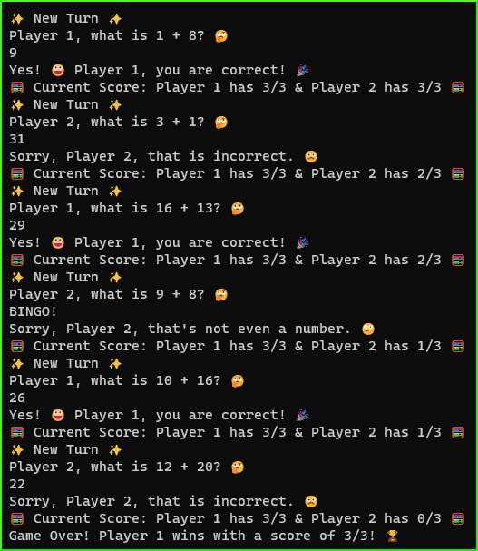

# 🧮 TwO-O-Player Math Game

This is a two player game, built in Ruby using using OOP (Object Oriented Programming) principles.\
Players begin the game with 3 lives each, and take turns answering simple math addition problems. A wrong answer will deduct 1 life. The game ends when only 1 player has lives remaining.

## Final Product

**Screenshot of Game Flow:**

## Game Intro 

### 📺 As Not Seen on TV 📺

Have you ever wished you could play a math game?\
How about one that runs right in your terminal?\
Something that challenges you by deducting a life for any wrong answers?! 🤔  

Now, you can! 😮\
And it's 🌟SO EASY🌟 to get started! 

Get ready to **MATH** with this emoji-filled game that'll challenge you with simple addition problems over and over and _over_ and ***over*** and-- until you just can't **MATH** anymore! 😅

You're probably thinking, _'this game only comes with 1 life'_, right? 🤔\
Wrong! 😲

📬 **We will send you:**

❌ Not 1 life\
❌❌ Not _2_ lives\
But **3** lives -- that's right!\
✅✅✅ 3 Lives ✅✅✅\
At no extra cost to you! 🎁

🛑 **BUT WAIT, THERE'S MORE!**

We know this offer is already pretty good -- but we want to make it even better! 😎

This game welcomes **TWO players**! 🤩

🧮 Let's break down the pricing:\
If **1** game for **1** player is _FREE_... 🤔\
Does that make **1** free game for **2** players...\
_**DOUBLE FREE**_ ❓❓❗🤯

🎮 **Download and play today!** 🕹️

Our developer ~~is standing by~~ ***~~had too much coffee~~*** ✨loves✨ writing ReadMe files! 😍

## Purpose

This project was created by [me](https://github.com/kazvee) as part of my learnings at [Lighthouse Labs](https://www.lighthouselabs.ca/en/web-development-flex-program).

## Dependencies

Ruby version 3.1.1 was used during app development & testing.

## Getting Started

- Fork this repository to your own Github account.
- Clone your fork onto your local device.
- From the project root folder in your terminal, start the game using the `ruby main.rb` command.
- To exit the game, press `Ctrl+C`
- Have fun! 😃